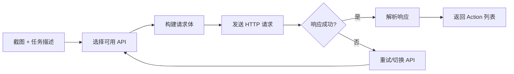
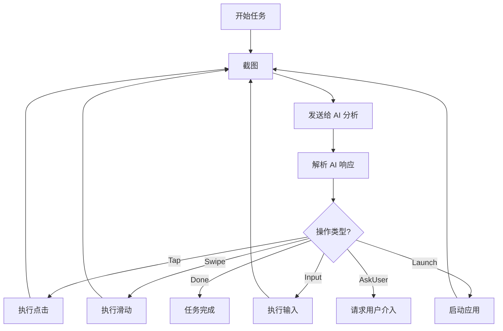
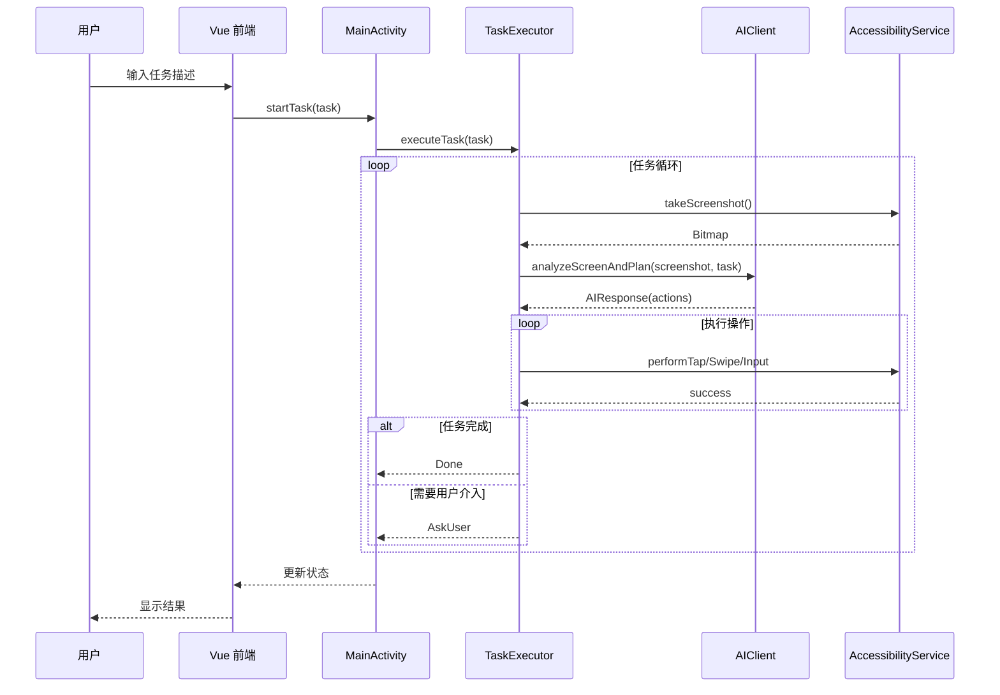

# Open-AutoGLM 项目架构文档

> 📅 生成时间: 2025-12-29  
> 📌 版本: v1.2.0+

---

## 📖 项目概述

**Open-AutoGLM** 是一个开源的 AI 手机自动化工具，通过视觉大语言模型（VLM）理解 Android 屏幕内容并自动执行用户指定的任务。项目采用 **Hybrid 架构**，结合 Kotlin 原生 Android 应用与 Vue 3 前端界面。

### 核心技术特点

| 技术 | 说明 |
|------|------|
| **Set-of-Marks (SoM)** | 在截图上叠加粉色数字标记，AI 直接引用标记 ID 点击，大幅提升准确率 |
| **双执行模式** | 支持无障碍服务（Accessibility）和 Shizuku（ADB）两种执行方式 |
| **多 AI 提供商** | 支持 OpenAI、Claude、Gemini 及 OpenAI 兼容格式的第三方 API |
| **Hybrid 架构** | WebView 容器 + Vue 3 前端，便于 UI 快速迭代 |

---

## ✅ 已实现功能清单

### 一、AI 智能分析

| 功能 | 描述 | 代码位置 |
|------|------|----------|
| **多 AI 提供商支持** | 支持 8 种 AI 服务商 | [ApiConfig.kt](file:///d:/Open-AutoGLM-App/app/src/main/java/com/autoglm/app/core/ApiConfig.kt) |
| ├─ 智谱 AI (GLM-4V) | 国产视觉大模型 | `AIProvider.ZHIPU` |
| ├─ OpenAI (GPT-4o) | GPT 系列模型 | `AIProvider.OPENAI` |
| ├─ Claude (3.5 Sonnet) | Anthropic 模型 | `AIProvider.CLAUDE` |
| ├─ Gemini (2.5 Flash) | Google AI 模型 | `AIProvider.GEMINI` |
| ├─ 通义千问 (Qwen-VL) | 阿里视觉模型 | `AIProvider.QWEN` |
| ├─ DeepSeek | 深度求索 | `AIProvider.DEEPSEEK` |
| ├─ Moonshot (Kimi) | 月之暗面 | `AIProvider.MOONSHOT` |
| └─ OpenAI 兼容接口 | 自定义端点 | `AIProvider.OPENAI_COMPATIBLE` |
| **API 轮询与故障转移** | 多 API 自动切换 | [AIClient.kt](file:///d:/Open-AutoGLM-App/app/src/main/java/com/autoglm/app/core/AIClient.kt) `getAvailableConfigs()` |
| **智能重试机制** | 网络错误自动重试 | [AIClient.kt](file:///d:/Open-AutoGLM-App/app/src/main/java/com/autoglm/app/core/AIClient.kt) `makeApiCallWithRetry()` |
| **致命错误检测** | 余额不足/认证失败停止 | [AIClient.kt](file:///d:/Open-AutoGLM-App/app/src/main/java/com/autoglm/app/core/AIClient.kt) `isFatalError()` |
| **统一提示词策略** | 自动判断 SoM/坐标模式 | [AIClient.kt](file:///d:/Open-AutoGLM-App/app/src/main/java/com/autoglm/app/core/AIClient.kt) `getUnifiedSystemPrompt()` |

---

### 二、Set-of-Marks (SoM) 技术

| 功能 | 描述 | 代码位置 |
|------|------|----------|
| **UI 元素检测** | 获取可点击元素列表 | [ShizukuTaskExecutor.kt](file:///d:/Open-AutoGLM-App/app/src/main/java/com/autoglm/app/core/ShizukuTaskExecutor.kt) `dumpUiHierarchy()` |
| **XML 解析** | 解析 uiautomator dump | [ShizukuTaskExecutor.kt](file:///d:/Open-AutoGLM-App/app/src/main/java/com/autoglm/app/core/ShizukuTaskExecutor.kt) `parseClickableElements()` |
| **标记绘制** | 粉色圆形+白色数字 | [SetOfMarks.kt](file:///d:/Open-AutoGLM-App/app/src/main/java/com/autoglm/app/core/SetOfMarks.kt) `drawMarks()` |
| **标记点击** | 根据 ID 查找并点击 | [ShizukuTaskExecutor.kt](file:///d:/Open-AutoGLM-App/app/src/main/java/com/autoglm/app/core/ShizukuTaskExecutor.kt) `clickByMark()` |
| **SoM 预览** | 查看带标记截图 | [MainActivity.kt](file:///d:/Open-AutoGLM-App/app/src/main/java/com/autoglm/app/MainActivity.kt) `onGetSomPreview()` |

---

### 三、双执行模式

| 功能 | 描述 | 代码位置 |
|------|------|----------|
| **无障碍模式** | 使用 AccessibilityService | [TaskExecutor.kt](file:///d:/Open-AutoGLM-App/app/src/main/java/com/autoglm/app/core/TaskExecutor.kt) |
| ├─ 屏幕截图 | `takeScreenshot()` API | [AutoGLMAccessibilityService.kt](file:///d:/Open-AutoGLM-App/app/src/main/java/com/autoglm/app/service/AutoGLMAccessibilityService.kt) `takeScreenshotBitmap()` |
| ├─ 手势点击 | GestureDescription 模拟 | [AutoGLMAccessibilityService.kt](file:///d:/Open-AutoGLM-App/app/src/main/java/com/autoglm/app/service/AutoGLMAccessibilityService.kt) `performTap()` |
| ├─ 手势滑动 | Path 绘制滑动轨迹 | [AutoGLMAccessibilityService.kt](file:///d:/Open-AutoGLM-App/app/src/main/java/com/autoglm/app/service/AutoGLMAccessibilityService.kt) `performSwipe()` |
| └─ 文本输入 | 设置焦点控件文本 | [AutoGLMAccessibilityService.kt](file:///d:/Open-AutoGLM-App/app/src/main/java/com/autoglm/app/service/AutoGLMAccessibilityService.kt) `performInput()` |
| **Shizuku 模式** | 使用 ADB 命令 | [ShizukuTaskExecutor.kt](file:///d:/Open-AutoGLM-App/app/src/main/java/com/autoglm/app/core/ShizukuTaskExecutor.kt) |
| ├─ ADB 截图 | `screencap` 命令 | `takeScreenshot()` |
| ├─ ADB 点击 | `input tap x y` | `executeAdbCommand()` |
| ├─ 剪贴板输入 | 支持中文输入 | `inputTextViaClipboard()` |
| └─ UI Dump | `uiautomator dump` | `dumpUiHierarchy()` |
| **模式选择记忆** | 记住用户偏好 | [MainActivity.kt](file:///d:/Open-AutoGLM-App/app/src/main/java/com/autoglm/app/MainActivity.kt) `onGetExecutionMode()` / `onSetExecutionMode()` |

---

### 四、操作类型

| 操作 | 描述 | 代码位置 |
|------|------|----------|
| **Tap** | 点击指定坐标 | [Action.kt](file:///d:/Open-AutoGLM-App/app/src/main/java/com/autoglm/app/core/Action.kt) `Action.Tap` |
| **TapMark** | 点击 SoM 标记 | [Action.kt](file:///d:/Open-AutoGLM-App/app/src/main/java/com/autoglm/app/core/Action.kt) `Action.TapMark` |
| **Swipe** | 从 A 点滑动到 B 点 | [Action.kt](file:///d:/Open-AutoGLM-App/app/src/main/java/com/autoglm/app/core/Action.kt) `Action.Swipe` |
| **LongPress** | 长按操作 | [Action.kt](file:///d:/Open-AutoGLM-App/app/src/main/java/com/autoglm/app/core/Action.kt) `Action.LongPress` |
| **Input** | 输入文本 | [Action.kt](file:///d:/Open-AutoGLM-App/app/src/main/java/com/autoglm/app/core/Action.kt) `Action.Input` |
| **Enter** | 按确认/回车键 | [Action.kt](file:///d:/Open-AutoGLM-App/app/src/main/java/com/autoglm/app/core/Action.kt) `Action.Enter` |
| **Back** | 返回键 | [Action.kt](file:///d:/Open-AutoGLM-App/app/src/main/java/com/autoglm/app/core/Action.kt) `Action.Back` |
| **Home** | 回到主屏幕 | [Action.kt](file:///d:/Open-AutoGLM-App/app/src/main/java/com/autoglm/app/core/Action.kt) `Action.Home` |
| **Launch** | 启动应用 | [Action.kt](file:///d:/Open-AutoGLM-App/app/src/main/java/com/autoglm/app/core/Action.kt) `Action.Launch` |
| **Wait** | 等待指定时间 | [Action.kt](file:///d:/Open-AutoGLM-App/app/src/main/java/com/autoglm/app/core/Action.kt) `Action.Wait` |
| **Done** | 任务完成 | [Action.kt](file:///d:/Open-AutoGLM-App/app/src/main/java/com/autoglm/app/core/Action.kt) `Action.Done` |
| **AskUser** | 请求用户介入 | [Action.kt](file:///d:/Open-AutoGLM-App/app/src/main/java/com/autoglm/app/core/Action.kt) `Action.AskUser` |

---

### 五、用户界面

| 功能 | 描述 | 代码位置 |
|------|------|----------|
| **Vue 3 前端** | WebView 混合架构 | [App.vue](file:///d:/Open-AutoGLM-App/frontend/src/App.vue) (~2816 行) |
| **深色模式** | 自动适应系统主题 | [App.vue](file:///d:/Open-AutoGLM-App/frontend/src/App.vue) CSS 类 `dark:` |
| **对话式界面** | 聊天气泡展示任务 | [App.vue](file:///d:/Open-AutoGLM-App/frontend/src/App.vue) `conversationTurns` |
| **AI 思考过程** | 展示 AI 决策逻辑 | [App.vue](file:///d:/Open-AutoGLM-App/frontend/src/App.vue) 思考折叠面板 |
| **对话历史管理** | 保存/恢复对话 | [MainActivity.kt](file:///d:/Open-AutoGLM-App/app/src/main/java/com/autoglm/app/MainActivity.kt) `onGetChatHistory()` / `onSaveChatHistory()` |
| **设置页面** | API/权限/日志配置 | [SettingsActivity.kt](file:///d:/Open-AutoGLM-App/app/src/main/java/com/autoglm/app/SettingsActivity.kt) |
| **JS-Kotlin 桥接** | 前端调用原生能力 | [Bridge.ts](file:///d:/Open-AutoGLM-App/frontend/src/Bridge.ts) |

---

### 六、悬浮窗服务

| 功能 | 描述 | 代码位置 |
|------|------|----------|
| **悬浮窗显示** | 系统级悬浮窗口 | [FloatingWindowService.kt](file:///d:/Open-AutoGLM-App/app/src/main/java/com/autoglm/app/service/FloatingWindowService.kt) |
| **日志实时展示** | 执行过程可视化 | `addLog()` |
| **拖拽移动** | 自由调整位置 | `handleDrag()` |
| **最小化/展开** | 收缩为小图标 | `minimize()` / `expand()` |
| **日志折叠** | 切换日志显示 | `toggleLogs()` |
| **暂停/恢复按钮** | 控制任务执行 | `updatePauseButton()` |
| **日志区域缩放** | 拖拽调整高度 | `handleResizeLog()` |

---

### 七、任务列表管理 (实验性)

| 功能 | 描述 | 代码位置 |
|------|------|----------|
| **创建任务列表** | 可视化脚本编辑 | [App.vue](file:///d:/Open-AutoGLM-App/frontend/src/App.vue) 任务列表模块 |
| **从对话导入** | 提取 AI 返回的命令 | [App.vue](file:///d:/Open-AutoGLM-App/frontend/src/App.vue) |
| **从文件导入** | 导入 .txt 脚本文件 | [MainActivity.kt](file:///d:/Open-AutoGLM-App/app/src/main/java/com/autoglm/app/MainActivity.kt) `onImportFromFile()` |
| **导出任务列表** | 导出为文本备份 | [MainActivity.kt](file:///d:/Open-AutoGLM-App/app/src/main/java/com/autoglm/app/MainActivity.kt) `onExportToFile()` |
| **重复区块** | `#repeat_start` / `#repeat_end` | [App.vue](file:///d:/Open-AutoGLM-App/frontend/src/App.vue) 重复区块渲染 |
| **任务列表持久化** | SharedPreferences 存储 | [MainActivity.kt](file:///d:/Open-AutoGLM-App/app/src/main/java/com/autoglm/app/MainActivity.kt) `onGetTaskLists()` / `onSaveTaskLists()` |

---

### 八、坐标拾取器

| 功能 | 描述 | 代码位置 |
|------|------|----------|
| **坐标拾取覆盖层** | 系统覆盖层服务 | [CoordPickerService.kt](file:///d:/Open-AutoGLM-App/app/src/main/java/com/autoglm/app/service/CoordPickerService.kt) |
| **双标记支持** | 点击/滑动坐标选择 | `createMarker()` (标记1蓝色, 标记2绿色) |
| **拖拽定位** | 拖动标记到目标位置 | `setupDrag()` |
| **实时坐标显示** | 显示当前坐标值 | `updateCoordLabel()` |
| **确认/取消按钮** | 提交或放弃选择 | `createButton()` |

---

### 九、Shizuku 权限管理

| 功能 | 描述 | 代码位置 |
|------|------|----------|
| **Shizuku 检测** | 检查是否安装 | [ShizukuHelper.kt](file:///d:/Open-AutoGLM-App/app/src/main/java/com/autoglm/app/shizuku/ShizukuHelper.kt) `isAvailable()` |
| **权限请求** | 请求 Shizuku 授权 | `requestPermission()` |
| **服务绑定** | 绑定 UserService | `bindUserService()` |
| **命令执行** | 执行 ADB 命令 | `executeCommand()` |
| **权限级别检测** | ADB/ROOT 区分 | `getUid()` / `isRoot()` / `isAdb()` |

---

### 十、日志系统

| 功能 | 描述 | 代码位置 |
|------|------|----------|
| **文件日志** | 保存到本地文件 | [FileLogger.kt](file:///d:/Open-AutoGLM-App/app/src/main/java/com/autoglm/app/util/FileLogger.kt) |
| **日志级别控制** | OFF/ERROR/WARN/INFO/DEBUG | `setLogLevel()` / `getLogLevel()` |
| **日志轮转** | 超过 5MB 自动轮转 | `rotateLogFile()` |
| **旧日志清理** | 最多保留 10 个文件 | `cleanOldLogs()` |
| **API 请求记录** | 记录 API 调用详情 | `logApiRequest()` |
| **API 响应记录** | 记录响应内容 | `logApiResponse()` |
| **日志内容获取** | 前端查看日志 | `getLatestLogContent()` |

---

### 十一、调试命令

| 命令 | 功能 | 处理位置 |
|------|------|----------|
| `#tap x,y` | 点击坐标 | [MainActivity.kt](file:///d:/Open-AutoGLM-App/app/src/main/java/com/autoglm/app/MainActivity.kt) 命令解析 |
| `#swipe x1,y1,x2,y2` | 滑动操作 | 同上 |
| `#type 文本` | 输入文本 | 同上 |
| `#enter` | 按确认键 | 同上 |
| `#back` | 按返回键 | 同上 |
| `#home` | 回到主屏幕 | 同上 |
| `#launch 应用名` | 启动应用 | [TaskExecutor.kt](file:///d:/Open-AutoGLM-App/app/src/main/java/com/autoglm/app/core/TaskExecutor.kt) `launchApp()` |
| `#screenshot` | 截图测试 | 执行器 `takeScreenshot()` |
| `#wait 毫秒` | 等待指定时间 | 执行器延迟执行 |
| `#repeat_start` | 开始重复区块 | [App.vue](file:///d:/Open-AutoGLM-App/frontend/src/App.vue) 脚本解析 |
| `#repeat_end N` | 结束重复区块(N次) | 同上 |

---

### 十二、API 配置管理

| 功能 | 描述 | 代码位置 |
|------|------|----------|
| **配置增删改查** | CRUD 操作 | [MainActivity.kt](file:///d:/Open-AutoGLM-App/app/src/main/java/com/autoglm/app/MainActivity.kt) `onGetApiConfigs()` / `onSaveApiConfig()` / `onDeleteApiConfig()` |
| **配置持久化** | SharedPreferences | [MainActivity.kt](file:///d:/Open-AutoGLM-App/app/src/main/java/com/autoglm/app/MainActivity.kt) |
| **自定义端点** | OpenAI 兼容接口支持 | [ApiConfig.kt](file:///d:/Open-AutoGLM-App/app/src/main/java/com/autoglm/app/core/ApiConfig.kt) `customEndpoint` |
| **优先级设置** | API 调用顺序 | [ApiConfig.kt](file:///d:/Open-AutoGLM-App/app/src/main/java/com/autoglm/app/core/ApiConfig.kt) `priority` |
| **启用/禁用切换** | 临时禁用配置 | [ApiConfig.kt](file:///d:/Open-AutoGLM-App/app/src/main/java/com/autoglm/app/core/ApiConfig.kt) `enabled` |

---

## 🏗️ 项目目录结构

```
Open-AutoGLM-App/
├── app/                              # Android 主模块
│   ├── src/main/java/com/autoglm/app/
│   │   ├── MainActivity.kt           # WebView 容器 & JS 桥接入口
│   │   ├── SettingsActivity.kt       # 设置页面
│   │   ├── IUserService.kt           # Shizuku AIDL 接口
│   │   ├── core/                     # 核心业务逻辑
│   │   │   ├── AIClient.kt           # AI API 客户端（多提供商）
│   │   │   ├── TaskExecutor.kt       # 无障碍模式任务执行器
│   │   │   ├── ShizukuTaskExecutor.kt# Shizuku 模式任务执行器
│   │   │   ├── Action.kt             # 操作类型定义
│   │   │   ├── ApiConfig.kt          # API 配置数据类
│   │   │   └── SetOfMarks.kt         # SoM 标记渲染
│   │   ├── service/                  # 系统服务
│   │   │   ├── AutoGLMAccessibilityService.kt  # 无障碍服务
│   │   │   ├── FloatingWindowService.kt        # 悬浮窗服务
│   │   │   └── CoordPickerService.kt           # 坐标拾取服务
│   │   ├── shizuku/                  # Shizuku 相关
│   │   │   ├── ShizukuHelper.kt      # Shizuku 权限管理
│   │   │   └── ShizukuUserService.kt # Shizuku 远程服务
│   │   ├── data/                     # 数据层
│   │   └── util/                     # 工具类
│   └── src/main/res/                 # Android 资源
│
├── frontend/                         # Vue 3 前端（WebView 加载）
│   ├── src/
│   │   ├── App.vue                   # 主应用组件（~138KB）
│   │   ├── Bridge.ts                 # JS-Kotlin 桥接层
│   │   ├── main.ts                   # 入口文件
│   │   ├── style.css                 # 全局样式
│   │   ├── assets/                   # 静态资源
│   │   └── components/               # Vue 组件
│   ├── package.json                  # 前端依赖
│   ├── vite.config.js                # Vite 构建配置
│   └── tailwind.config.js            # TailwindCSS 配置
│
├── docs/                             # 文档资源
├── logs/                             # 日志目录
├── build.gradle.kts                  # Gradle 构建脚本
└── README.md                         # 项目说明
```

---

## 🔧 核心模块详解

### 1. MainActivity.kt（WebView 容器）

**文件位置**: `app/src/main/java/com/autoglm/app/MainActivity.kt`  
**代码行数**: ~1426 行 | **方法数量**: 73+

#### 核心职责

- 初始化 WebView 并加载 Vue 前端
- 通过 `@JavascriptInterface` 暴露原生能力给前端
- 管理任务执行的生命周期
- 处理权限请求（悬浮窗、无障碍、Shizuku）

#### 关键方法

| 方法 | 说明 |
|------|------|
| `setupWebView()` | 配置 WebView 并注入 JS 接口 |
| `onStartTask(task)` | 启动任务（自动选择执行模式） |
| `onStartTaskWithMode(task, mode)` | 指定模式启动任务 |
| `onStopTask()` | 停止当前任务 |
| `onTogglePause()` | 暂停/恢复任务 |
| `onGetApiConfigs()` / `onSaveApiConfig()` | API 配置管理 |
| `onCheckShizukuAvailable()` | 检查 Shizuku 可用性 |
| `sendToWeb(function, data)` | 向前端发送数据 |

---

### 2. AIClient.kt（AI 客户端）

**文件位置**: `app/src/main/java/com/autoglm/app/core/AIClient.kt`  
**代码行数**: ~1166 行

#### 核心职责

- 与多种 AI 提供商通信（OpenAI、Claude、Gemini）
- 构建符合各提供商格式的请求
- 解析 AI 响应并转换为 `Action` 对象
- 实现 API 轮询、智能重试和故障转移

#### 支持的 AI 提供商

| 提供商 | 请求构建方法 | 响应解析方法 |
|--------|-------------|-------------|
| OpenAI 兼容 | `buildOpenAICompatibleRequest()` | `parseOpenAIResponse()` |
| Claude | `buildClaudeRequest()` | `parseClaudeResponse()` |
| Gemini | `buildGeminiRequest()` | `parseGeminiResponse()` |

#### 核心流程



#### 关键方法

| 方法 | 说明 |
|------|------|
| `analyzeScreenAndPlan()` | 主入口：发送截图获取操作指令 |
| `makeApiCallWithRetry()` | 带重试的 API 调用 |
| `parseUnifiedResponse()` | 统一响应解析（支持多种格式） |
| `getUnifiedSystemPrompt()` | 生成系统提示词（智能判断 SoM） |
| `isFatalError()` | 判断是否为致命错误（余额不足等） |

---

### 3. TaskExecutor.kt（无障碍模式执行器）

**文件位置**: `app/src/main/java/com/autoglm/app/core/TaskExecutor.kt`  
**代码行数**: ~615 行

#### 核心职责

- 执行任务循环：截图 → AI 分析 → 执行操作
- 通过无障碍服务执行点击、滑动、输入等操作
- 管理任务状态（运行中、暂停、停止）
- 记录执行日志

#### 核心流程



#### 关键方法

| 方法 | 说明 |
|------|------|
| `executeTask(task)` | 启动任务执行（协程入口） |
| `executeLoop(task)` | 主执行循环 |
| `takeScreenshot()` | 通过无障碍服务截图 |
| `executeAction(action)` | 执行具体操作 |
| `launchApp(appName)` | 启动应用（支持模糊匹配） |
| `pause()` / `resume()` | 暂停/恢复任务 |

---

### 4. ShizukuTaskExecutor.kt（Shizuku 模式执行器）

**文件位置**: `app/src/main/java/com/autoglm/app/core/ShizukuTaskExecutor.kt`  
**代码行数**: ~964 行

#### 核心职责

- 使用 ADB 命令代替无障碍服务执行操作
- 通过 `screencap` 命令截图
- 通过 `uiautomator dump` 获取 UI 层级用于 SoM
- 支持剪贴板输入（解决 ADB 中文输入问题）

#### 与 TaskExecutor 的区别

| 特性 | TaskExecutor (无障碍) | ShizukuTaskExecutor (Shizuku) |
|------|---------------------|------------------------------|
| 截图方式 | `takeScreenshot()` API | `adb shell screencap` |
| 点击方式 | `GestureDescription` | `input tap x y` |
| 中文输入 | 设置剪贴板文本 | 剪贴板 + `input keyevent PASTE` |
| UI 元素获取 | 无障碍节点 | `uiautomator dump` |
| 性能 | 较低 | 较高 |

#### 关键方法

| 方法 | 说明 |
|------|------|
| `takeScreenshot()` | 通过 ADB screencap 命令截图 |
| `getMarkedScreenshot()` | 获取带 SoM 标记的截图 |
| `dumpUiHierarchy()` | 获取 UI 层级 XML |
| `parseClickableElements()` | 解析可点击元素 |
| `clickByMark(markId)` | 根据 SoM 标记 ID 点击 |
| `inputTextViaClipboard()` | 通过剪贴板输入文本 |

---

### 5. AutoGLMAccessibilityService.kt（无障碍服务）

**文件位置**: `app/src/main/java/com/autoglm/app/service/AutoGLMAccessibilityService.kt`  
**代码行数**: ~220 行

#### 核心职责

- 提供屏幕截图能力（Android 11+）
- 执行点击、滑动、输入等手势操作
- 执行全局操作（返回、主屏幕）

#### 关键方法

| 方法 | 说明 |
|------|------|
| `performTap(x, y)` | 模拟点击 |
| `performSwipe(x1, y1, x2, y2, duration)` | 模拟滑动 |
| `performInput(text)` | 在焦点输入框设置文本 |
| `performBack()` | 执行返回操作 |
| `performHome()` | 返回主屏幕 |
| `takeScreenshotBitmap()` | 截取屏幕 |

---

### 6. ShizukuHelper.kt（Shizuku 管理）

**文件位置**: `app/src/main/java/com/autoglm/app/shizuku/ShizukuHelper.kt`  
**代码行数**: ~299 行

#### 核心职责

- 管理 Shizuku 服务连接
- 处理 Shizuku 权限请求
- 执行 ADB 命令

#### 关键方法

| 方法 | 说明 |
|------|------|
| `init()` | 初始化 Shizuku 监听器 |
| `isAvailable()` | 检查 Shizuku 是否可用 |
| `hasPermission()` | 检查是否有权限 |
| `requestPermission()` | 请求权限 |
| `bindUserService()` | 绑定远程服务 |
| `executeCommand(command)` | 执行 ADB 命令 |

---

### 7. Action.kt（操作类型定义）

**文件位置**: `app/src/main/java/com/autoglm/app/core/Action.kt`  
**代码行数**: ~88 行

#### 支持的操作类型

```kotlin
sealed class Action {
    data class Tap(val x: Int, val y: Int)                    // 点击
    data class Swipe(x1, y1, x2, y2, duration)               // 滑动
    data class Input(val text: String)                        // 输入文本
    data class Done(val message: String)                      // 任务完成
    data class Wait(val milliseconds: Long)                   // 等待
    object Back                                               // 返回
    object Home                                               // 主屏幕
    data class AskUser(val reason: String)                   // 请求用户介入
    data class Launch(val appName: String)                   // 启动应用
    object Enter                                              // 确认键
    data class LongPress(x, y, duration)                     // 长按
    data class TapMark(val markId: Int)                      // SoM 点击
}
```

---

### 8. Bridge.ts（前端桥接层）

**文件位置**: `frontend/src/Bridge.ts`  
**代码行数**: ~470 行

#### 核心职责

- 定义 `AndroidInterface` 类型，映射所有 Kotlin 暴露的方法
- 提供类型安全的前端调用封装
- 处理 Android WebView 回调

#### 接口分类

| 类别 | 方法示例 |
|------|---------|
| 任务控制 | `startTask`, `stopTask`, `togglePause` |
| 权限管理 | `checkOverlayPermission`, `openAccessibilitySettings` |
| API 配置 | `getApiConfigs`, `saveApiConfig`, `deleteApiConfig` |
| Shizuku | `checkShizukuAvailable`, `executeAdbCommand` |
| 设置 | `getLogLevel`, `setDevMode`, `getExecutionMode` |
| 文件操作 | `exportToFile`, `importFromFile` |

---

## 🔄 核心执行流程



---

## 📦 技术栈

### Android 端

| 技术 | 用途 |
|------|------|
| **Kotlin** | 主要开发语言 |
| **Coroutines** | 异步任务处理 |
| **OkHttp 4.x** | HTTP 请求 |
| **Gson** | JSON 解析 |
| **AndroidX** | Jetpack 组件 |
| **Shizuku** | ADB 权限代理 |

### 前端

| 技术 | 用途 |
|------|------|
| **Vue 3** | UI 框架 |
| **TypeScript** | 类型安全 |
| **Vite** | 构建工具 |
| **TailwindCSS** | 样式框架 |

---

## 🔐 权限要求

| 权限 | 用途 | 必需性 |
|------|------|-------|
| **无障碍服务** | 截图、执行手势 | 无障碍模式必需 |
| **悬浮窗** | 显示执行状态和日志 | 可选 |
| **Shizuku** | ADB 命令执行 | Shizuku 模式必需 |

---

## 📝 调试命令

在输入框中使用 `#` 前缀直接执行操作：

| 命令 | 说明 |
|------|------|
| `#tap 500,800` | 点击坐标 (500, 800) |
| `#swipe 500,1500,500,500` | 从 (500,1500) 滑动到 (500,500) |
| `#type 你好世界` | 输入文本 |
| `#enter` | 按确认键 |
| `#back` | 按返回键 |
| `#home` | 回到主屏幕 |
| `#launch Chrome` | 启动应用 |
| `#screenshot` | 截图测试 |
| `#wait 1000` | 等待 1000ms |

---

## 🔗 相关资源

- [README.md](./README.md) - 项目说明
- [AutoGLM 核心项目](https://github.com/zai-org/Open-AutoGLM)
- [Open-AutoGLM-Hybrid 参考](https://github.com/xietao778899-rgb/Open-AutoGLM-Hybrid)

---

*本文档由 AI 自动生成，如有疑问请参考源代码。*
