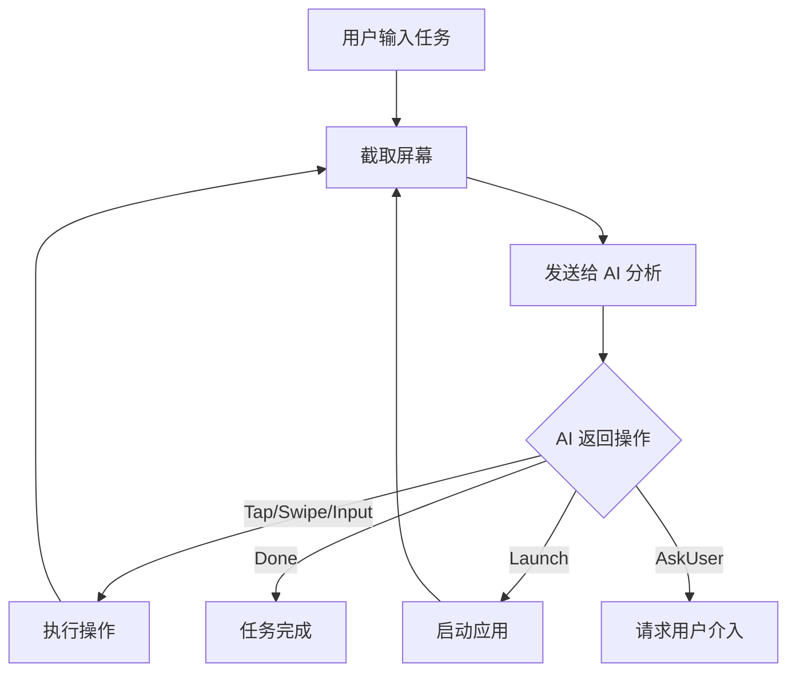

# Open-AutoGLM

<p align="center">
  
</p>

<p align="center">
  <strong>AI 驱动的 Android 手机自动化助手</strong>
</p>

<p align="center">
  <a href="#功能特性">功能特性</a> •
  <a href="#快速开始">快速开始</a> •
  <a href="#使用指南">使用指南</a> •
  <a href="#架构设计">架构设计</a> •
  <a href="#开发指南">开发指南</a>
</p>

---

## 📖 简介

Open-AutoGLM 是一个**开源的 AI 手机自动化工具**，通过视觉大语言模型（VLM）理解屏幕内容并自动执行任务。只需用自然语言描述你想做的事，AI 就会像真人一样操作你的手机。

**示例任务**：
- "打开微信给张三发消息说明天见"
- "在淘宝搜索蓝牙耳机并按销量排序"
- "打开设置把亮度调到最高"

## ✨ 功能特性

### 核心功能
- 🤖 **AI 驱动** - 支持 OpenAI、Claude、Gemini 等多种大模型
- 📱 **纯 Kotlin 实现** - 无需 Termux，单个 APP 即可使用
- 🎯 **多操作执行** - 单次 AI 调用可返回多个连续操作
- 🔄 **智能重试** - 自动处理网络错误和 API 限流
- ⏸️ **暂停/恢复** - 随时控制任务执行

### 用户体验
- 🌓 **深色模式** - 自动适应系统主题
- 💬 **AI 思考过程** - 实时展示 AI 的决策逻辑
- 📊 **详细日志** - 完整记录每一步操作
- 🎨 **现代 UI** - 基于 Vue 3 的精美界面
- 如果AI抽风大概率是AI本身太蠢,或者检查提示词的合理性(目前暂时不支持在APP里修改提示词)

### 安全特性
- 🔒 **本地运行** - 除API请求数据外不经过第三方服务器
- 🛡️ **权限最小化** - 仅请求必要权限
- ⚠️ **致命错误保护** - 余额不足等问题自动终止

## 🚀 快速开始

### 环境要求
- Android 7.0 (API 24) 或更高版本
- 至少一个 AI API Key（OpenAI / Claude / Gemini / 其他兼容 API）建议白嫖智谱的API,至少母亲AutoGLM-Phone能白嫖

### 安装步骤

1. **下载 APK**
   - 从 [Releases](https://github.com/yourusername/Open-AutoGLM/releases) 下载最新版本

2. **安装并授权**
   - 安装 APK
   - 开启**无障碍服务**权限
   - 开启**悬浮窗**权限（可选，用于显示执行状态）

3. **配置 API**
   - 打开 APP，进入设置
   - 添加你的 API 配置（API Key、Base URL）

4. **开始使用**
   - 在主界面输入任务描述
   - 点击"执行"开始自动化

## 📖 使用指南

### 支持的 AI 提供商

| 提供商 | 推荐模型 | 说明 |
|--------|----------|------|
| OpenAI | gpt-4o, gpt-4o-mini | 官方 API 或兼容接口 |
| Claude | claude-3-5-sonnet | Anthropic 官方 API |
| Gemini | gemini-2.5-flash | Google AI Studio |
| 其他 | 任意 VLM | OpenAI 兼容格式 |

### 调试命令

在输入框中使用 `#` 开头的命令可以直接测试基础操作：

```
#tap 500,800      - 点击坐标 (500, 800)
#swipe 500,1500,500,500  - 从 (500,1500) 滑动到 (500,500)
#type 你好世界    - 输入文本
#enter            - 按确认键
#back             - 按返回键
#home             - 回到主屏幕
#launch Chrome    - 启动应用
#screenshot       - 截图测试
```

### Launch 命令说明

`#launch` 使用**严格精确匹配**策略：
- 只有应用名称完全匹配才会启动
- 找不到精确匹配时，会提示相似的应用名称
- 支持使用包名直接启动（如 `#launch com.android.chrome`）

## 🏗️ 架构设计

```
Open-AutoGLM-App/
├── app/                          # Android 主模块
│   ├── src/main/java/com/autoglm/app/
│   │   ├── MainActivity.kt       # Hybrid WebView 容器
│   │   ├── core/
│   │   │   ├── AIClient.kt       # AI API 客户端（支持多提供商）
│   │   │   ├── TaskExecutor.kt   # 任务执行引擎
│   │   │   └── Action.kt         # 操作类型定义
│   │   ├── service/
│   │   │   └── AutoGLMAccessibilityService.kt  # 无障碍服务
│   │   └── ui/
│   │       └── WebAppInterface.kt  # JS-Kotlin 桥接
│   └── src/main/res/
│       └── ...
├── frontend/                     # Vue 3 前端
│   ├── src/
│   │   ├── App.vue               # 主应用
│   │   └── Bridge.ts             # 与 Native 通信
│   └── ...
└── docs/                         # 文档资源
```

### 核心流程



## 🛠️ 开发指南

### 从源码构建

```bash
# 克隆仓库
git clone https://github.com/yourusername/Open-AutoGLM.git
cd Open-AutoGLM

# 构建前端
cd frontend
npm install
npm run build
cd ..

# 构建 APK
./gradlew assembleDebug
```

生成的 APK 位于：`app/build/outputs/apk/debug/app-debug.apk`

### 技术栈

**Android 端**
- Kotlin + Coroutines
- OkHttp 4.x（网络请求）
- Gson（JSON 解析）
- AndroidX（Jetpack 组件）

**前端**
- Vue 3 + TypeScript
- Vite（构建工具）
- TailwindCSS（样式）

### 添加新的 AI 提供商

1. 在 `AIClient.kt` 的 `AIProvider` 枚举中添加新提供商
2. 实现对应的 `build*Request()` 方法
3. 实现对应的 `parse*Response()` 方法

## 📄 许可证

本项目采用 [CC BY-NC-SA 4.0](LICENSE) 协议。

- ✅ 允许分享、修改
- ✅ 需要署名、相同方式共享
- ❌ **禁止商业使用**
- ❌ 作者不承担任何责任

## 🙏 致谢

本项目的实现离不开以下开源项目和资源：

- [AutoGLM](https://github.com/zai-org/Open-AutoGLM) 核心项目
- [Open-AutoGLM-Hybrid](https://github.com/xietao778899-rgb/Open-AutoGLM-Hybrid) 参考项目

感谢所有为开源社区做出贡献的开发者们！

## 🤝 贡献

欢迎提交 Issue 和 Pull Request！

## ⚠️ 免责声明

- 本工具仅供学习和个人使用
- 请勿用于违反法律法规或平台规定的用途
- 使用本工具产生的任何后果由用户自行承担

---

<p align="center">
  Made with ❤️ by the Open-AutoGLM Community
</p>
